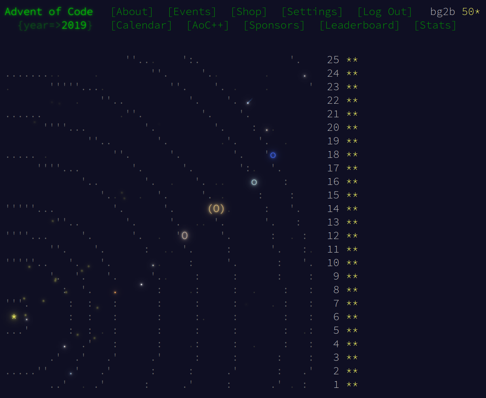

# Advent of Code 2019

Info and problems are available at https://adventofcode.com/2019

## Overview

Each day's problem input and solution is in a subdirectory, `01`, `02`, etc.

Solutions are C++.  Compile with:
```
g++ -std=c++17 -Wall -g -o doit doit.cc
```

Input has sometimes been pre-processed for ease of reading.
Example input if any is called `input1`.
The real input is `input` (note, my inputs are no longer included in
the repository).

Input is on stdin, output is printed to stdout.  Run part 1 as `./doit
1 < input` and part 2 as `./doit 2 < input`

Sometimes I might go back and revisit a problem in a different
(usually more efficient) way.  Alternatives will be other `.cc` files
starting with `doit`.

## Recommended problems

Here's my list of recommended problems for the year, along
with direct links.  Recommendations are based on a combination of
factors: perhaps the problem admits an unusual and clever solution, or
perhaps it would allow an interesting visualization, or perhaps the
problem description itself was cute.  In whatever way, I found the
problem unusually fun.  Each of these problems is either ⭐
(recommended) or ⭐⭐ (highly recommended).

+ [Day 10: Monitoring Station](https://adventofcode.com/2019/day/10) ⭐
+ [Day 13: Care Package](https://adventofcode.com/2019/day/13) ⭐⭐
+ [Day 15: Oxygen System](https://adventofcode.com/2019/day/15) ⭐
+ [Day 16: Flawed Frequency Transmission](https://adventofcode.com/2019/day/16) ⭐⭐
+ [Day 17: Set and Forget](https://adventofcode.com/2019/day/17) ⭐⭐
+ [Day 18: Many-Worlds Interpretation](https://adventofcode.com/2019/day/18) ⭐⭐
+ [Day 20: Donut Maze](https://adventofcode.com/2019/day/20) ⭐
+ [Day 21: Springdroid Adventure](https://adventofcode.com/2019/day/21) ⭐
+ [Day 22: Slam Shuffle](https://adventofcode.com/2019/day/22) ⭐⭐
+ [Day 25: Cryostasis](https://adventofcode.com/2019/day/25) ⭐⭐


